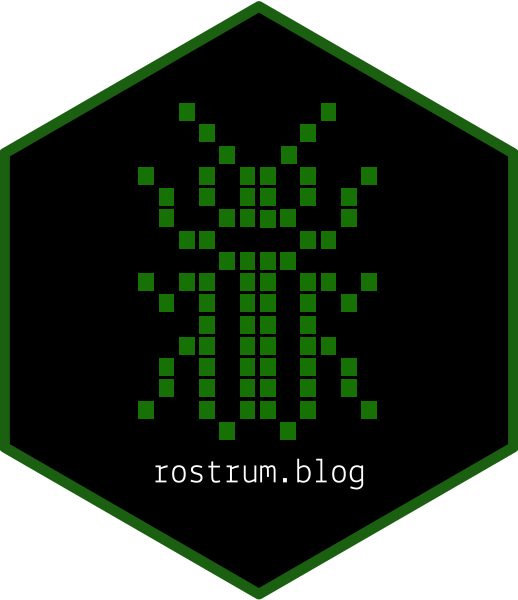

class: middle, center, inverse

# Make a Twitter bot with {rtweet} and GitHub Actions

# `r fontawesome::fa("robot")`

## LondonR, 2022-02-17

[matt-dray.com .super[`r fontawesome::fa("link")`]](https://www.matt-dray.com)

---
class: middle

# tl;dr

* [.dark-font[Scroll through @londonmapbot .super[`r fontawesome::fa("link")`]]](https://www.twitter.com/londonmapbot)

* [.dark-font[Clone on GitHub .super[`r fontawesome::fa("link")`]]](https://www.github.com/matt-dray/londonmapbot)

* [.dark-font[Read the blog .super[`r fontawesome::fa("link")`]]](https://www.rostrum.blog/2020/09/21/londonmapbot/)

---
class: middle

# Eh?

1. Who?

1. What?

1. How?

---
class: middle, center, inverse

# Who?

---
class: middle, center

<a href="https://www.matt-dray.com"></a>

---
class: middle, center

<a href="https://www.rostrum.blog"></a>

???
* Turning showerthoughts into learning

---
class: middle, center, inverse

# What?

---
class: middle, center, inverse
background-image: url("images/profile.png")
background-size: 100%

---
class: middle, center, inverse
background-image: url("images/tweet.png")
background-size: 100%

---
class: inverse
background-image: url("images/Ewv-OO3VkAcDV8k.jpg")
background-size: 120%

---
class: inverse
background-image: url("images/FHxwDeDVcAUUb69.jpg")
background-size: 120%

---
class: inverse
background-image: url("images/E9DEbx9XMAIGD4c.jpg")
background-size: 120%

---
class: inverse
background-image: url("images/Eu0ssieXMAAuSmw.jpg")
background-size: 120%

---
class: inverse
background-image: url("images/FHsHJuHXsAYPxJ3.jpg")
background-size: 120%

---
class: middle

# [.dark-font[`r fontawesome::fa("twitter")` {rtweet} .super[`r fontawesome::fa("link")`]]](https://docs.ropensci.org/rtweet/)

* Twitter API access from R

* [.dark-font[By Mike Kearney .super[`r fontawesome::fa("link")`]]](https://twitter.com/kearneymw)

* Free API, with limitations

???
* Limited to 18k tweets every 15 mins 
* To request more than that, set `retryonratelimit = TRUE`

---
class: middle

```
rtweet::search_tweets(
  "#rstats",
  n = 10000,
  include_rts = FALSE
)
```

---
class: middle

# [.dark-font[`r fontawesome::fa("map")` MapBox .super[`r fontawesome::fa("link")`]]](https://www.mapbox.com/)

* Satellite imagery via API

* Free, with limitations

???
* Covers the Earth at multiple zoom levels
* Just replace URL elements
* 50k requests total, x requests per min

---
class: middle

[MapBox screenshot]

---
class: middle

# [.dark-font[`r fontawesome::fa("github")` GitHub Actions .super[`r fontawesome::fa("link")`]]](https://github.com/features/actions)

* Run code on schedule

* Free, with limitations

???
* Used for continuous integration, like R package testing, coverage and {pkgdown} deployment
* Public repo, x minutes

---
class: middle

[GitHub Actions screenshot]

---
class: middle, center, inverse

# How?

---
class: middle

# [.dark-font[`r fontawesome::fa("twitter")` Twitter .super[`r fontawesome::fa("link")`]]](https://docs.ropensci.org/rtweet/)

1. [.dark-font[Get developer status .super[`r fontawesome::fa("link")`]]](https://developer.twitter.com/en/docs/twitter-api/getting-started/getting-access-to-the-twitter-api)

1. [.dark-font[Get elevated API access .super[`r fontawesome::fa("link")`]]](https://developer.twitter.com/en/docs/twitter-api/getting-started/about-twitter-api)

1. [.dark-font[Get keys .super[`r fontawesome::fa("link")`]]](https://developer.twitter.com/en/docs/twitter-api/getting-started/about-twitter-api)

???
* 'Elevated' status allows access to API v1.1, which is what {rtweet} uses
* [.dark-font[It was Oscar Baruffa who told me about this .super[`r fontawesome::fa("link")`]]](https://oscarbaruffa.com/twitterbot/)

---
class: middle

# `r fontawesome::fa("map")` MapBox

1. [.dark-font[Sign up .super[`r fontawesome::fa("link")`]]](https://account.mapbox.com/auth/signup/)

1. [.dark-font[Get tokens .super[`r fontawesome::fa("link")`]]](https://docs.mapbox.com/api/accounts/tokens/)

---
class: middle

# `r fontawesome::fa("github")` Github

1. Create public repo

1. [.dark-font[Store keys as secrets .super[`r fontawesome::fa("link")`]]](https://docs.github.com/en/actions/security-guides/encrypted-secrets)

1. Create scripts


---
class: middle

# Two files (!)

* bot/
    - .github/workflows/bot.yml<br>
    - bot.R

---
class: middle

# [.dark-font[bot.yml .super[`r fontawesome::fa("link")`]]](https://github.com/matt-dray/londonmapbot/blob/master/.github/workflows/londonmapbot.yml)


```{r eval=FALSE}
name: londonmapbot

on:
  schedule:
    - cron: '42 0/2 * * *'

jobs:
  londonmapbot-post:
    runs-on: macOS-latest
    env:
      TWITTER_CONSUMER_API_KEY: ${{ secrets.TWITTER_CONSUMER_API_KEY }}
      TWITTER_CONSUMER_API_SECRET: ${{ secrets.TWITTER_CONSUMER_API_SECRET }}
      TWITTER_ACCESS_TOKEN: ${{ secrets.TWITTER_ACCESS_TOKEN }}
      TWITTER_ACCESS_TOKEN_SECRET: ${{ secrets.TWITTER_ACCESS_TOKEN_SECRET }}
      MAPBOX_PUBLIC_ACCESS_TOKEN: ${{ secrets.MAPBOX_PUBLIC_ACCESS_TOKEN }}
    steps:
      - uses: actions/checkout@v2
      - uses: r-lib/actions/setup-r@master
      - name: Install rtweet package
        run: Rscript -e 'install.packages("rtweet", dependencies = TRUE)'
      - name: Create and post tweet
        run: Rscript londonmapbot-tweet.R
```

---
class: middle

# bot.yml detail

Schedule

```{r eval=FALSE}
on:
  schedule:
    - cron: '42 0/2 * * *'
```

Secrets

```{r eval=FALSE}
    env:
      TWITTER_CONSUMER_API_KEY: ${{ secrets.TWITTER_CONSUMER_API_KEY }}
```

???
* Cron here reads as 'minute 42 every two hours from hour 0'
* Use a cron helper like [.dark-font[crontab.guru .super[`r fontawesome::fa("link")`]]](https://crontab.guru/), or my own [.dark-font[{dialga} package .super[`r fontawesome::fa("link")`]]](https://www.rostrum.blog/2021/04/10/dialga/) for converting R to cron to English
* The 'env' step is adding the secrets to the environment from the secrets stash in the repo

---
class: middle

# bot.yml detail

Setup

```{r eval=FALSE}
    steps:
      - uses: actions/checkout@v2
      - uses: r-lib/actions/setup-r@master
```

Run

```{r eval=FALSE}
      - name: Install rtweet package
        run: Rscript -e 'install.packages("rtweet", dependencies = TRUE)'
      - name: Create and post tweet
        run: Rscript londonmapbot-tweet.R
```

???
* You can handy pre-prepared code from r-lib to set up the R environment on the remote worker
* You can split your steps up and name them, so you'll know where any errors occurred when you read your GitHub Actions logs
* You can write R directly into this file, or source an R script, like our bot.R file

---
class: middle

# [.dark-font[bot.R .super[`r fontawesome::fa("link")`]]](https://github.com/matt-dray/londonmapbot/blob/master/londonmapbot-tweet.R) 

Token

```{r eval=FALSE}
# Create Twitter token
londonmapbot_token <- rtweet::create_token(
  app = "londonmapbot",
  consumer_key =    Sys.getenv("TWITTER_CONSUMER_API_KEY"),
  consumer_secret = Sys.getenv("TWITTER_CONSUMER_API_SECRET"),
  access_token =    Sys.getenv("TWITTER_ACCESS_TOKEN"),
  access_secret =   Sys.getenv("TWITTER_ACCESS_TOKEN_SECRET")
)
```

???
* bot.yml called the secrets from the repo into the environment, now we can pull the tokens into an R object
* The token can then be used to access the Twitter API

---
class: middle

# [.dark-font[bot.R .super[`r fontawesome::fa("link")`]]](https://github.com/matt-dray/londonmapbot/blob/master/londonmapbot-tweet.R) 

Image

```{r eval=FALSE}
# Generate random coordinates within specific limits
lon <- round(runif(1, -0.489, 0.236), 4)
lon <- format(lon, scientific = FALSE)
lat <- round(runif(1, 51.28, 51.686), 4)

# Build URL and fetch image from Mapbox API
img_url <- paste0(
  "https://api.mapbox.com/styles/v1/mapbox/satellite-v9/static/",
  paste0(lon, ",", lat),
  ",15,0/600x400@2x?access_token=",
  Sys.getenv("MAPBOX_PUBLIC_ACCESS_TOKEN")
)

# Download the image to a temporary location
temp_file <- tempfile()
download.file(img_url, temp_file)
```

???
* Sample latitude and longitude
* Put these into the MapBox API string
* Download file to temporary location

---
class: middle

# [.dark-font[bot.R .super[`r fontawesome::fa("link")`]]](https://github.com/matt-dray/londonmapbot/blob/master/londonmapbot-tweet.R)

Tweet

```{r eval=FALSE}
# Build the status message (text and URL)
latlon_details <- paste0(
  lat, ", ", lon, "\n",
  "https://www.openstreetmap.org/#map=17/", lat, "/", lon, "/"
)

# Post the image to Twitter
rtweet::post_tweet(
  status = latlon_details,
  media = temp_file,
  token = londonmapbot_token
)
```

???
* Generate a string containing the coordinates and an OpenStreetMap link
* Post the tweet, containing the text string and image, using the API token

---
class: middle

# Quickstart

* Fork londonmapbot
* Use the repo as a template


---
class: middle, center, inverse

# The mapbotverse
#`r fontawesome::fa('robot')`

---
class: middle

[Placeholder text]

---
class: middle, center, inverse

`r fontawesome::fa('twitter')` [@mattdray .super[`r fontawesome::fa("link")`]](https://www.twitter.com/mattdray)

`r fontawesome::fa('github')` [matt-dray .super[`r fontawesome::fa("link")`]](https://www.github.com/matt-dray)

`r fontawesome::fa('pen')` [rostrum.blog .super[`r fontawesome::fa("link")`]](https://www.rostrum.blog)

`r fontawesome::fa('globe')` [matt-dray.com .super[`r fontawesome::fa("link")`]](https://www.matt-dray.com)
